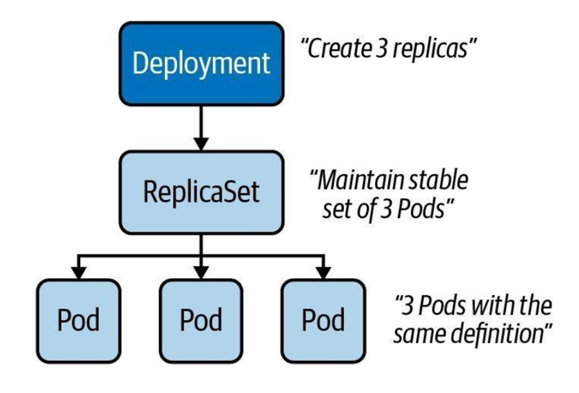

# 🧪 TP de Prise en Main de Kubernetes avec Minikube

Ce lab vous guide pas à pas dans la découverte des concepts de base de Kubernetes à l'aide de **Minikube**, dans un environnement local ou cloud (GitHub Codespaces, Gitpod, etc.).



---

## ⚙️ Prérequis

Avant de commencer, assurez-vous que Minikube est démarré :

```
minikube start
```
## Création manuelle d'un Pod
```
kubectl run nginx-pod --image=nginx
```
Vérifier la création du pod :
```
kubectl get pods
```
## Suppression du Pod
```
kubectl delete pod nginx-pod
```
Vérifier que le pod est supprimé :
```
kubectl get pods
```
## Création d'un Pod via un fichier YAML
Créer un fichier nginx-pod.yaml :
```
apiVersion: v1
kind: Pod
metadata:
  name: nginx-pod
spec:
  containers:
  - name: nginx
    image: nginx
```
Appliquer le fichier :
```
kubectl apply -f nginx-pod.yaml
```
Vérifier :
```
kubectl get pods
```
## Suppression du Pod via YAML
```
kubectl delete -f nginx-pod.yaml
```
## Création d’un ReplicaSet
Les Pods créés manuellement ne sont pas maintenus en cas de panne.
Un ReplicaSet permet d'assurer une disponibilité minimale.

Créer un fichier nginx-replicaset.yaml :
```
apiVersion: apps/v1
kind: ReplicaSet
metadata:
  name: nginx-replicaset
spec:
  replicas: 3
  selector:
    matchLabels:
      app: nginx
  template:
    metadata:
      labels:
        app: nginx
    spec:
      containers:
      - name: nginx
        image: nginx
```
Appliquer le fichier :
```
kubectl apply -f nginx-replicaset.yaml
```
Vérifier :
```
kubectl get pods
kubectl get replicaset
```
## Test de la recréation automatique d’un Pod
Supprimer un Pod :
```
kubectl delete pod <nom-du-pod>
```
Vérifier que le ReplicaSet recrée automatiquement un Pod :
```
kubectl get pods
```
Suppression du ReplicaSet
```
kubectl delete -f nginx-replicaset.yaml
```
## Création d’un Déploiement Nginx
Créer un fichier nginx-deployment.yaml :
```
apiVersion: apps/v1
kind: Deployment
metadata:
  name: nginx-deployment
spec:
  replicas: 3
  selector:
    matchLabels:
      app: nginx
  template:
    metadata:
      labels:
        app: nginx
    spec:
      containers:
      - name: nginx
        image: nginx
```
Appliquer le fichier :
```
kubectl apply -f nginx-deployment.yaml
```
Vérifier :
```
kubectl get deployments
kubectl get replicaset
```
## Suppression d’un ReplicaSet (et vérification de la recréation)
Supprimer un ReplicaSet associé au déploiement :
```
kubectl delete replicaset <nom-du-replicaset>
```
Vérifier la recréation par le déploiement :
```
kubectl get replicaset
kubectl get pods
```
## Création d’un Service de type ClusterIP
Créer un fichier nginx-service.yaml :
```
apiVersion: v1
kind: Service
metadata:
  name: nginx-service
spec:
  selector:
    app: nginx
  ports:
    - protocol: TCP
      port: 80
      targetPort: 80
```
Appliquer le fichier :
```
kubectl apply -f nginx-service.yaml
```
Vérifier le service :
```
kubectl get svc
```
## Test du service avec port-forward
Rediriger le port local 8080 vers le service :
```
kubectl port-forward svc/nginx-service 8080:80
```
Accédez ensuite à votre pod via :
```
http://localhost:8080
```
Dans Gitpod ou Codespaces, utilisez le lien généré pour le port 8080.


